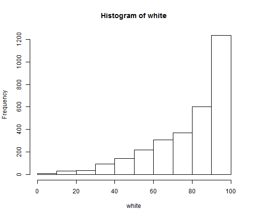

## Source of Data 

### 2010 Census data

Looking at the census data is a hard task:

```r
data<-readRDS("./data/counties.rds")

data[1:5,1:6]
```

```
##              name total.pop white black hispanic asian
## 1 alabama,autauga     54571  77.2  19.3      2.4   0.9
## 2 alabama,baldwin    182265  83.5  10.9      4.4   0.7
## 3 alabama,barbour     27457  46.8  47.8      5.1   0.4
## 4    alabama,bibb     22915  75.0  22.9      1.8   0.1
## 5  alabama,blount     57322  88.9   2.5      8.1   0.2
```

--- .class #id 

## Data Exploration

Even looking at the summary stats is not easy:


```r
summary(data)
```

```
##    Length     Class      Mode 
##         1 character character
```

---

## The Interactive Graphical Web App

Instead, I have created a web-interface to graphically explore the data and get graphs like:


```r
white<-data$white
hist(white)
```

 

---

## Now it is simple and easy to explore the data


### Easy to launch:

###### library(shiny)
###### runGitHub ("project", username="amimiz")


